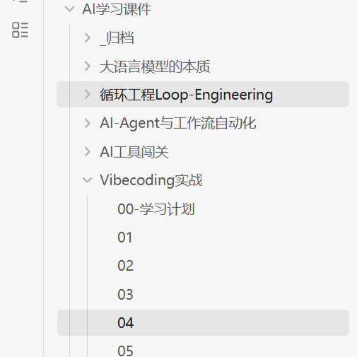
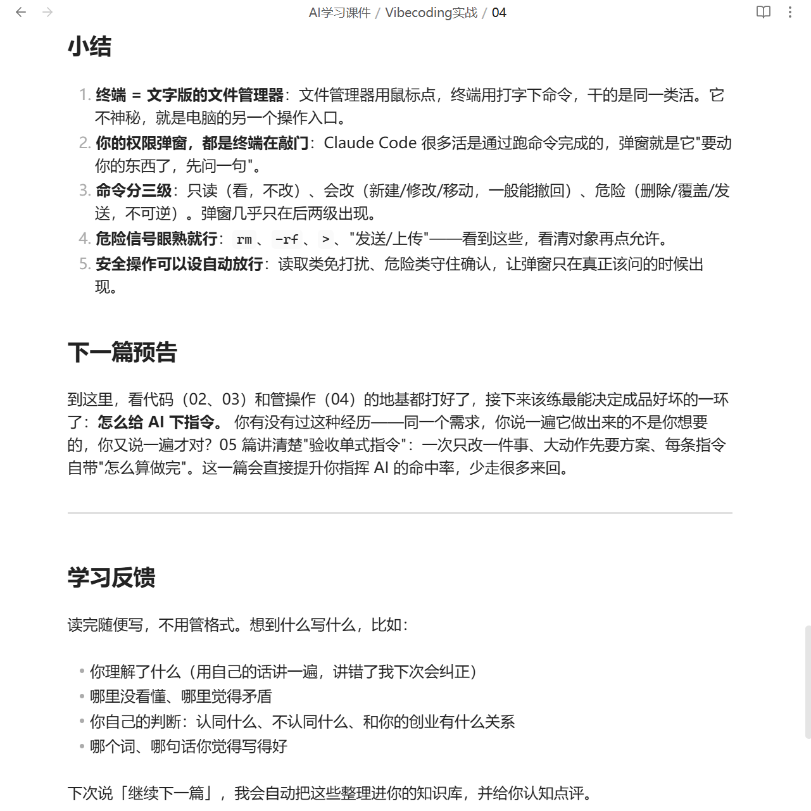
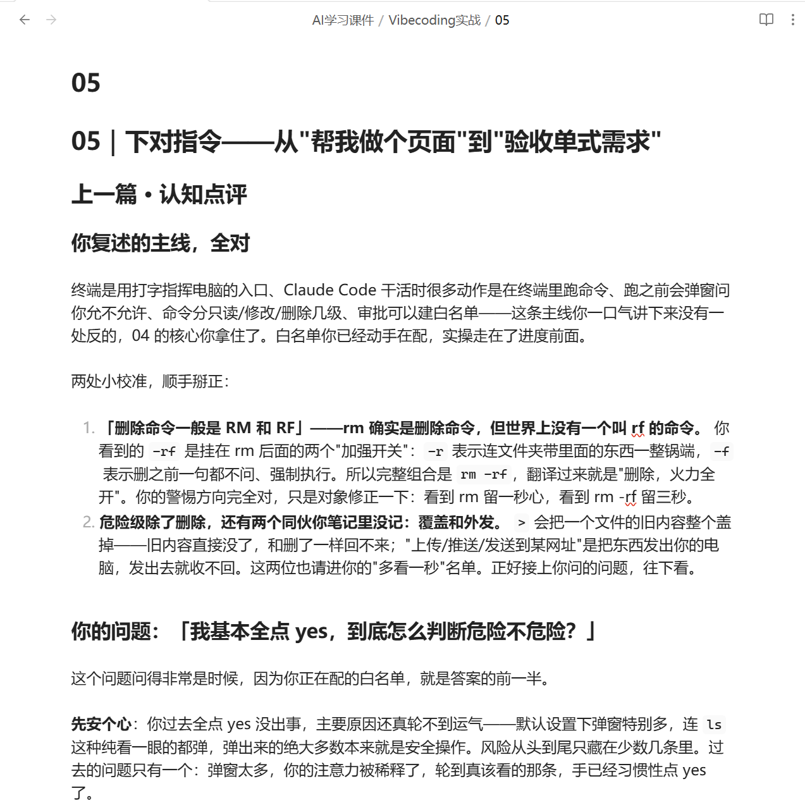
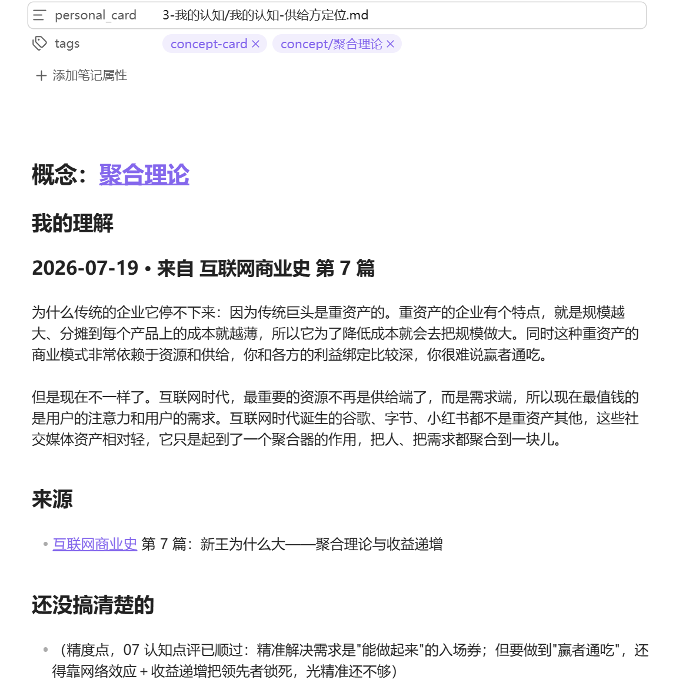
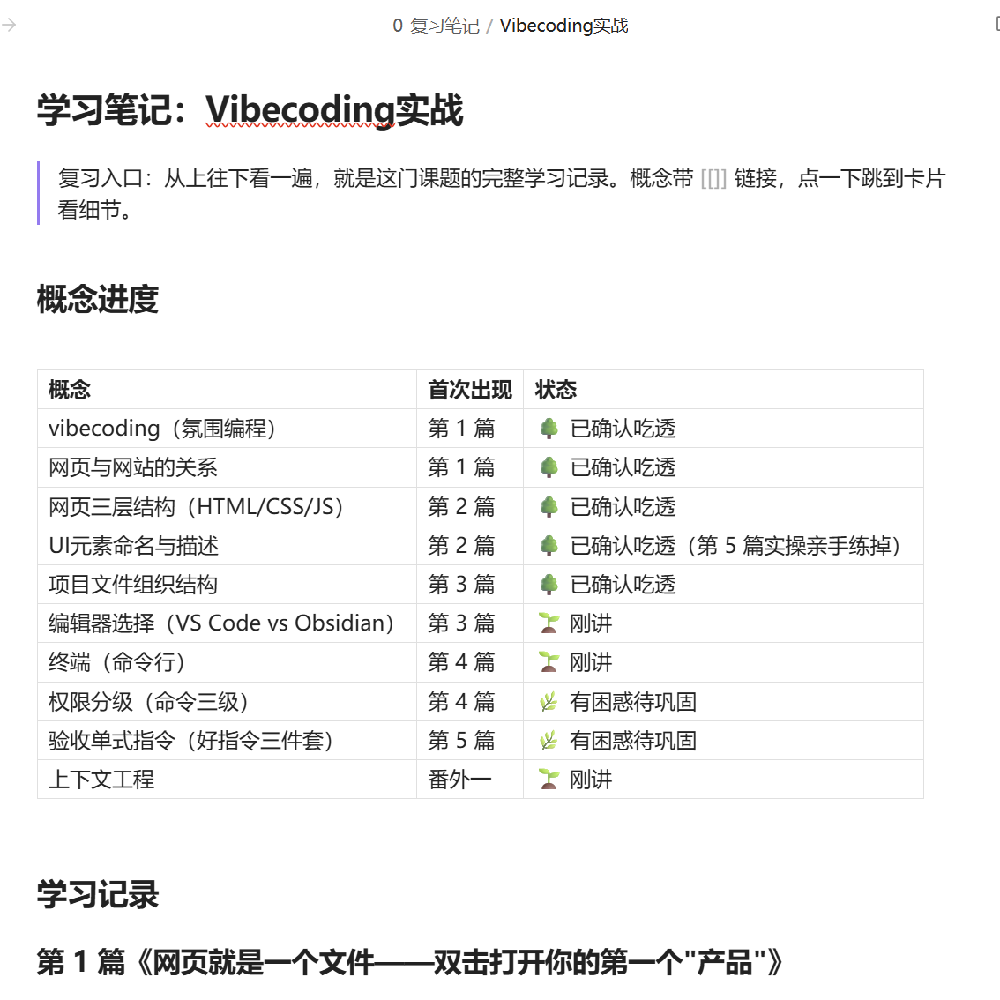
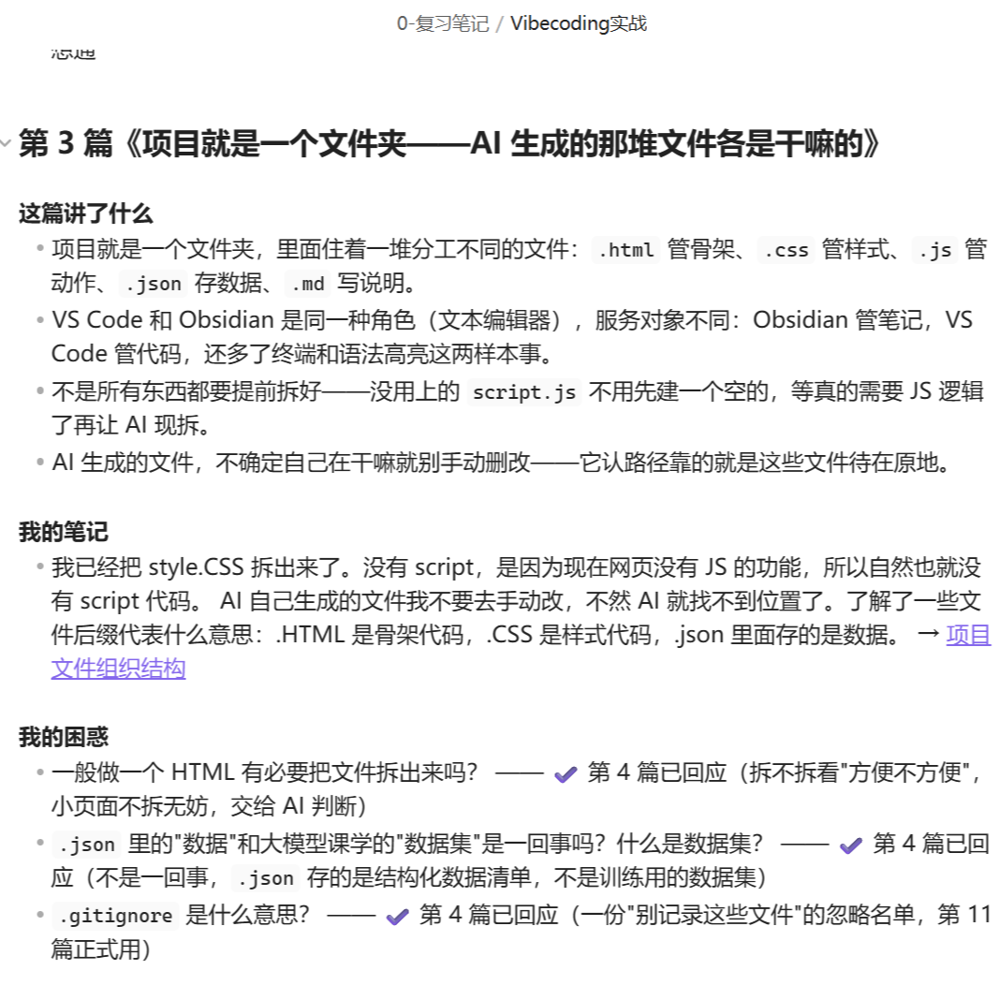

# grace-coach：AI私教老师

帮你系统地读书、学人、搞懂行业和概念，把学到的东西沉淀成你自己的本地知识库（Markdown 文件，Obsidian 可直接打开看双链图谱）。

<table>
<tr>
<td width="50%"><br/><sub>课题按篇连载，目录一目了然</sub></td>
<td width="50%"><br/><sub>每篇末尾学习反馈区，读完随便写、不用管格式</sub></td>
</tr>
<tr>
<td width="50%"><br/><sub>认知点评：下一篇开头校准你的理解、回应你的问题</sub></td>
<td width="50%"><br/><sub>反馈自动整理成知识卡片，原话入库、标好来源</sub></td>
</tr>
<tr>
<td width="50%"><br/><sub>核心概念掌握进度一目了然：🌱 刚讲 → 🌿 有困惑 → 🌳 已吃透</sub></td>
<td width="50%"><br/><sub>复习笔记按篇追加，笔记和困惑都留痕，回应过的会标注</sub></td>
</tr>
</table>

## 核心功能

- **四种学习模式**：读书、学一个人的思想、多人综合对比、行业/概念（联网搜最新信息）
- **定制化教学**：开课题时问你学这个想用在哪，经你授权还能参考你的个人背景，之后每篇的举例和讲法都贴着你的情况走
- **连载式推进**：一次只讲一篇，根据你的反馈自动调节下一篇的难度和角度
- **随便写，自动归档**：读完在文章末尾想到什么写什么，自动切分成读书笔记 / 个人判断 / 困惑三类，整理成知识卡片入库。进卡片的永远是你的原话
- **进卡前核实**：记错了的概念先拦下来和你确认，不让错误知识入库
- **认知点评 + 教回来核对**：纠正你的事实错误、挑战你的判断、回应你的困惑；对照你的复述检查是不是真懂了
- **知识库联动**：生成每篇前先翻你本地已有的知识卡片，接着你已经懂的往深讲、不重复，主动把不同书、不同课题的概念串起来
- **掌握进度追踪**：每个核心概念的状态一目了然（🌱 刚讲 → 🌿 有困惑 → 🌳 已吃透），每课题自动维护一本复习笔记

## 适合人群

- **自学者 / 终身学习者**：想系统读书但苦于没有人带节奏、读完记不住
- **内容创作者**：需要快速吃透一个领域来做输出，想把学习过程直接沉淀成素材库
- **转行 / 跨领域的人**：想搞懂一个新行业或新概念怎么运作，需要一个从零开始的学习路径
- **做知识管理的人**：已经在用 Obsidian 等笔记工具，想让学习笔记自动整理归档而不是散落各处

## 推荐用法

- **跨书串联**：围绕同一个概念（比如「复利」「杠杆」），让它把好几本书、好几个人的说法打通了一起讲，帮你跨过书与书之间的边界
- **多人对比**：学一个主题时，让它选几个观点不同的人各讲一章，最后综合对比，帮你形成自己的判断
- **用你的目的定制**：开课题时说清楚学这个想用在哪（创业？写文章？转行？），它会把每篇的举例和反馈提示都贴着你的目的走

## 安装

前提：你在用 [Claude Code](https://claude.com/claude-code) 或其他支持 [Agent Skills](https://github.com/vercel-labs/skills) 的工具。方式一另需装 [Node.js](https://nodejs.org)。

### 方式一：一行命令（推荐）

```
npx skills add https://github.com/GraceXie0727/grace-coach --skill grace-coach
```

按提示选「global」和「symlink」，装完重启 Claude Code 即可。

### 方式二：把下面这段话发给 AI

复制粘贴给 Claude Code / Cursor / 任何有 shell 权限的 AI Agent，它会自动装好：

```
帮我安装 grace-coach 这个 Claude Code skill，请按下面步骤做：
1. 确保 ~/.claude/skills/ 目录存在（不存在就创建）
2. 执行：git clone https://github.com/GraceXie0727/grace-coach.git ~/.claude/skills/grace-coach
3. 验证：ls ~/.claude/skills/grace-coach/ 应该看到 SKILL.md、modes/ 两项
4. 告诉我装好了，之后我说「带我读《无穷的开始》」就会触发这个 skill
```

### 方式三：手动命令行

```
git clone https://github.com/GraceXie0727/grace-coach.git ~/.claude/skills/grace-coach
```

装完重启 Claude Code。

## 示例请求

装好后，直接对 AI 说：

```
带我读《无穷的开始》
```

```
学巴菲特关于投资的认知
```

```
带我了解 AI 行业怎么运作
```

```
带我系统性地入门 AI
```

```
结合市面上的相关书籍，带我了解中美互联网商业史
```

读完一篇，在文章末尾「学习反馈」区随便写几句，下次说「**继续下一篇**」。

## 学习库目录结构

```
AI学习教练/
├── INDEX.md          ← 所有课题的进度索引
├── 课题/             ← 连载学习文章
├── 复习笔记/         ← 每课题一本，复习就看它
└── 知识卡片/
    ├── 概念/         ← 你对概念的理解（你的原话）
    └── 我的判断/     ← 你的个人判断（你的原话）
```

第一次使用时它会问你学习库建在哪（默认「文档/AI学习教练/」），以后所有文件都存在那里，是普通的 Markdown 文件。

## 致谢与来源

- 本 skill 的连续学习循环（章节化学习文章 + 学习反馈区 + 自适应学习梯度 + 部分写作原则）基于 [dontbesilent](https://github.com/dontbesilent2025) 的开源 skill **dbs-learning**（[dontbesilent2025/dbskill](https://github.com/dontbesilent2025/dbskill)，CC BY-NC 4.0）改造。知识卡片入库、进卡前核实、认知点评、教回来核对、概念掌握进度、复习笔记、名人/行业学习模式为本项目的原创扩展。
- 「概念掌握进度」和「教回来核对」两个功能的设计思路，受到 [alexknowshtml/claude-skills](https://github.com/alexknowshtml/claude-skills) 中 teach skill 与 [GarethManning/education-agent-skills](https://github.com/GarethManning/education-agent-skills) 的启发，在此致谢。

## 授权

[CC BY-NC 4.0](LICENSE) © 2026 Grace

可自由使用、修改、分享，需保留署名；**禁止商业用途**。

---

作者：Grace（[X @Gracexie0727](https://x.com/Gracexie0727)），有问题欢迎提 [Issue](../../issues)~
